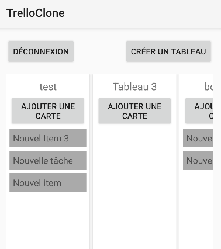
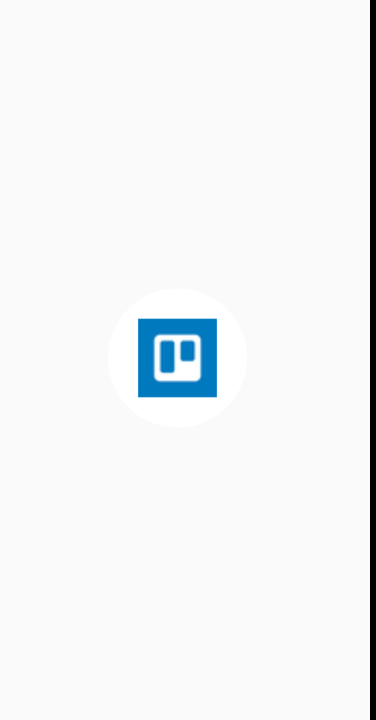

# 📋 Trello Clone


Bienvenue dans **Trello Clone**, une application Android inspirée de Trello qui permet de créer et gérer des tableaux, des listes et des cartes, le tout directement depuis votre smartphone ! 📱

---

## 🚀 **Fonctionnalités**
- 📂 **Créer des tableaux** pour organiser vos projets.
- 📝 **Ajouter des listes et des items** à chaque tableau.
- 🔄 **Données persistantes** avec `SharedPreferences` (les tableaux et items sont sauvegardés même après la fermeture de l'app !).
- 🌟 **Interface intuitive** qui se rapproche de l'expérience Trello.
- 🎉 **Splash Screen personnalisé** avec le logo de l'application.

---

## 🖥️ **Aperçu de l'application**

### **Écran d'accueil**
Affichage de tous les tableaux créés par l'utilisateur.


---

### **Création de tableau**
L'utilisateur peut ajouter un nouveau tableau en saisissant son nom. 


---

### **Splash Screen**
Un écran de démarrage élégant qui affiche le logo de l'application.


---

## 📲 **Installation**

### **Prérequis**
- l'apk est dans le build

---

### **Étapes d'installation**

1️⃣ **Clonez le dépôt :**
```bash
git clone https://github.com/nestea29950/trello-clone-kotlin.git
